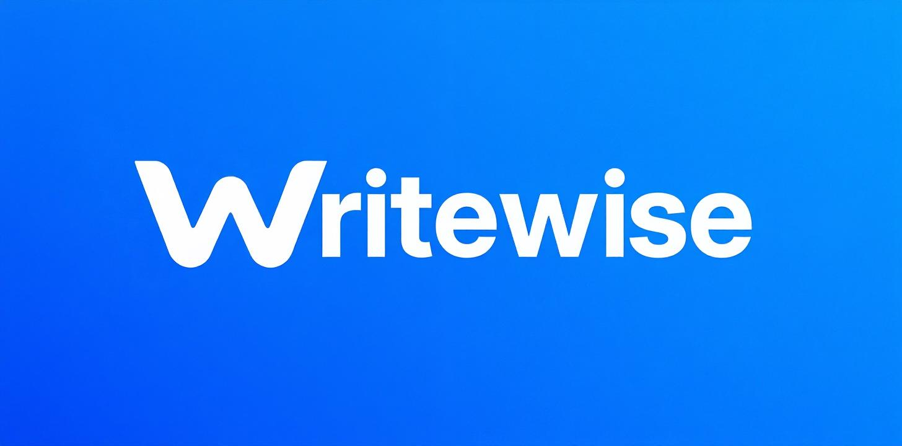

# 🚀 Writewise - AI Writing Assistant for Content Creators

<div align="center">



**An AI-powered writing assistant built specifically for content creators**

[]()
[]()
[]()
[](https://writewise-8fke.vercel.app/)
[]()

</div>

---

## 📋 **Overview**

Writewise is a next-generation writing assistant designed specifically for **content creators** who need more than basic grammar checking. Unlike traditional tools, Writewise understands the unique challenges creators face: maintaining authentic voice, avoiding platform penalties, creating engaging content that converts, and optimizing for search engines and different platforms.

**🧠 Flagship Innovation**: The **Priority Optimization Engine** - a revolutionary system that dynamically adjusts suggestion priorities based on platform context, audience needs, and formality levels, seamlessly integrating audience adaptation and tone-preserving capabilities.

### 🎯 **Built For:**
- 📝 **Blog Writers** - Personal and professional bloggers
- 📰 **Article Authors** - Magazine and online publication writers  
- 📱 **Marketing Copywriters** - Social media, email, and web copy creators
- 🎥 **Video Script Writers** - YouTube, TikTok, and podcast creators
- 📧 **Newsletter Writers** - Email marketing and community builders

---

## 🧠 **Priority Optimization Engine** ⭐ *FLAGSHIP FEATURE*

**Revolutionary AI-powered system that intelligently resolves suggestion conflicts and adapts recommendations based on context.**

### **🎯 Dynamic Priority Adjustments**
**Platform-Specific Priority Profiles:**
- **TikTok/Instagram**: Prioritizes slang protection (+30), engagement (+25), reduces formal style corrections (-15)
- **LinkedIn**: Reduces slang protection (-20), boosts style (+20) and grammar (+15) for professionalism
- **Twitter**: Balances casual tone (+15 slang) with engagement (+15) and readability (+5 style)
- **YouTube**: Maximizes engagement (+30) for video descriptions, protects casual language (+20)
- **Blog/Email**: Professional focus with high style (+25) and grammar (+20) priorities

**Formality-Based Adjustments:**
- **Casual Mode**: Maximum slang protection (+35), reduced formal style suggestions (-20)
- **Professional Mode**: Highest style (+30) and grammar (+25) priorities, minimal slang protection (-30)
- **Balanced Mode**: Neutral adjustments with slight engagement boost (+5)

### **🎪 Integrated Platform Adaptation**
- **Multi-Platform Intelligence**: Adapts suggestions for LinkedIn, Twitter, YouTube, TikTok, Instagram, Facebook, Blog, Email
- **Audience-Specific Tone Adjustments**: Automatically generates platform-optimized alternatives
- **Character Limit Optimization**: Smart suggestions for platform constraints
- **Engagement Tactics Integration**: Platform-specific hooks, CTAs, and best practices
- **Seamless Experience**: No separate visual indicators - integrated into existing suggestion types

### **⚖️ Conflict Resolution Modes**
- **Grammar-First**: Prioritizes correctness over tone preservation
- **Tone-First**: Maximizes voice preservation with intelligent rewrites
- **Balanced**: Optimal balance between correctness and authenticity
- **User-Choice**: Present all conflicts for manual resolution

---

## 📋 **Core Features Implementation (5/5 Complete)**

### **1. Demonetization Word Filter**
**User Story**: *"As a content creator, I want flagged alerts for words that could demonetize my videos so I can use safer alternatives."*

- Orange wavy underlines highlight potentially problematic words
- AI-powered alternatives in 3 categories: Industry Standard, Conservative, Creative
- 100+ word detection across violence, adult content, controversial topics
- Context-aware analysis using OpenAI GPT-4
- Caching system prevents repeated API calls

### **2. Context-Aware Grammar Checking**
**User Story**: *"As a creator, I want slang like 'that fit is fire' to be recognized as intentional so I'm not corrected for stylistic choices."*

- Green dotted underlines protect intentional slang expressions
- AI-first slang detection using GPT-4's contextual understanding
- 70+ slang expression database with pattern matching
- Formality level controls (Casual/Balanced/Formal) adjust protection levels
- Intent detection distinguishes intentional vs. accidental usage

### **3. Tone-Preserving Rewrites**
**User Story**: *"As a creator, I want AI to fix grammar issues without changing the vibe of my sentence."*

- Purple solid underlines for tone-preserving suggestions
- AI tone analysis detects 4 style categories (Casual, Professional, Creative, Academic)
- **Integrated with Priority Optimization**: Seamlessly resolves conflicts between grammar and tone
- Style matching preserves original voice while fixing errors
- Confidence scoring with detailed reasoning explanations

### **4. Engagement Enhancement**
**User Story**: *"As a content creator, I want to get suggestions to increase reader engagement so that my content performs better and keeps audiences interested."*

- Pink double underlines highlight engagement opportunities
- 6 analysis categories: Opening Hook, Call-to-Action, Emotional Language, Reader Interaction, Transitions, Urgency/Scarcity
- Category badges and sparkle icons (✨) for alternatives
- Engagement scoring (1-10) with context-aware improvements
- Performance optimization with caching for repeated analysis

### **5. Enterprise SEO Content Optimization**
**User Story**: *"As a content creator, I want SEO-friendly suggestions for better discoverability so my content ranks higher in search results."*

- Purple wavy underlines for comprehensive SEO suggestions
- **4-Phase Implementation**:
  - **Phase 1**: Backend SEO Analysis Engine
  - **Phase 2**: Frontend Integration & Visual Design
  - **Phase 3**: Advanced Features (Templates, Analytics, Research)
  - **Phase 4**: Enterprise Tools (Competitor Analysis, Technical SEO, E-A-T)
- Multi-faceted analysis: Keywords, content structure, readability, meta optimization
- Advanced features: Templates, analytics dashboard, competitor analysis
- Enterprise tools: Technical SEO audit, local SEO, multilingual support, E-A-T optimization
- Featured snippets & voice search optimization with real-time scoring

**Total**: **5 out of 5 Core Features Complete** ✅ **+ Priority Optimization Engine** 🧠

Each feature includes comprehensive AI integration, visual design systems, performance optimization, and enterprise-grade capabilities that provide immediate value to content creators.

---

## 🚀 **Quick Start**

### **Prerequisites**
- Node.js 18+ (tested with Node.js 22.15.1)
- npm or yarn
- OpenAI API key

### **Installation**

1. **Clone the repository**
   ```bash
   git clone https://github.com/trevoralpert/Writewise.git
   cd writewise
   ```

2. **Install dependencies**
   ```bash
   npm install
   ```

3. **Set up environment variables**
   ```bash
   # Create .env file in root directory
   OPENAI_API_KEY=your_openai_api_key_here
   ```

4. **Start the development server**
   ```bash
   npm run dev
   ```

5. **Open your browser**
   - Frontend: `http://localhost:5180` (or next available port)
   - Backend API: `http://localhost:3001`

### **🌐 Live Demo**
Want to try Writewise without setup? Check out our deployed version:
- **Live App**: [https://writewise-8fke.vercel.app/](https://writewise-8fke.vercel.app/)

> **Note**: The live demo showcases all 5 implemented core features plus the Priority Optimization Engine with platform adaptation capabilities. For development and customization, use the local setup above.

---

## 🏗️ **Technical Architecture**

### **Frontend Stack**
- ⚛️ **React 19** with TypeScript for type safety
- 🎨 **Tailwind CSS** for responsive, modern UI design
- ✏️ **Tiptap Editor** for rich text editing with real-time suggestions
- 🗄️ **Zustand** for comprehensive state management (40+ SEO variables)
- 🧭 **React Router** for navigation and multi-page experience

### **Backend Stack**
- 🟢 **Node.js** with Express for API server
- 🤖 **OpenAI GPT-4/GPT-4o** integration for advanced AI analysis
- 💾 **Advanced caching system** with 5-minute TTL for performance optimization
- 📊 **Session management** for analytics and user tracking
- 🛡️ **Error handling** with graceful degradation and edge case management

### **AI Integration**
- 🧠 **Context-aware prompting** for nuanced text analysis
- 🔄 **Multi-model approach** combining rule-based and AI detection
- 📈 **Confidence scoring** for suggestion reliability
- 💡 **Reasoning explanations** for educational user experience
- 🎯 **3-phase analysis pipeline** with Priority Optimization Engine

### **3-Phase Suggestion Pipeline**
```
Content Input → Tone Analysis → Multi-Engine Processing → Conflict Detection → 
Priority Optimization & Platform Adaptation → Final Suggestions
```

**Phase 1: Multi-Engine Analysis**
- Grammar/Spelling detection, Style analysis, Demonetization scanning
- Slang/context detection, Engagement analysis, SEO optimization analysis

**Phase 2: Intelligent Conflict Resolution**
- Overlap detection between suggestions
- Context-aware filtering to prevent inappropriate flagging
- Dynamic priority calculation based on platform/audience context

**Phase 3: Priority Optimization & Platform Adaptation**
- Platform-specific priority adjustments
- Formality-based priority modifications
- Audience-adapted alternative generation
- Tone-preserving rewrite creation when needed

### **SEO Analysis Engine**
- 🔍 **Multi-phase SEO pipeline**: Basic → Advanced → Enterprise → Performance
- 📊 **Real-time analytics** with comprehensive content scoring
- 🏢 **Enterprise features**: Competitor analysis, technical audits, E-A-T optimization
- 🌍 **Multilingual support** with local SEO optimization
- 🎤 **Voice search & featured snippets** optimization

---

## 📊 **Analytics & Performance**

### **Real-Time Dashboard**
- 📈 **Writing Quality Metrics**: Readability, sentence variety, vocabulary richness
- ⏱️ **Performance Tracking**: Word count, time spent, suggestion acceptance rates
- 📋 **Suggestion Breakdown**: Analysis by type, category, and acceptance rates
- 🔍 **SEO Analytics**: Content score, keyword analysis, technical metrics
- 🏢 **Enterprise Metrics**: Domain authority, topic authority, competitor analysis
- 🎯 **Priority Optimization Stats**: Conflict resolution and platform adaptation metrics

### **Export Capabilities**
- 📄 **Multiple Formats**: JSON, Markdown, HTML, CSV
- 📊 **Professional Reports** with analytics and suggestions
- ⏰ **Timestamped Data** for progress tracking
- 👥 **Client-Ready Formatting** for professional use
- 🔍 **SEO Reports** with comprehensive optimization insights

---

## 🎨 **Visual Design System**

### **Color-Coded Suggestions**
- 🔴 **Red wavy** - Grammar/spelling errors
- 🔵 **Blue wavy** - Style and clarity improvements  
- 🟠 **Orange wavy** - Demonetization warnings
- 🟢 **Green dotted** - Protected slang expressions
- 🟣 **Purple solid** - Tone-preserving rewrites
- 🩷 **Pink double** - Engagement enhancements
- 🟣 **Purple wavy** - SEO optimization suggestions

### **Interactive Elements**
- 🎯 **Context-sensitive popups** with detailed explanations
- 🔄 **Multiple alternatives** for each suggestion
- 🧠 **AI reasoning** helps users understand recommendations
- ⚡ **One-click application** for quick improvements
- 📚 **Educational examples** for learning grammar rules
- 🔍 **SEO impact scoring** with progress bars and metrics
- 🎪 **Platform adaptation indicators** integrated into existing suggestions
- ⚖️ **Priority conflict resolution** with intelligent suggestions

---

## ⚙️ **Configuration**

### **Settings Panel**
- 🔧 **Feature Toggles** for each suggestion type
- 📊 **Formality Level Controls** for audience-appropriate corrections
- 🎛️ **Sensitivity Adjustments** for tone detection
- ⚖️ **Conflict Resolution Modes** for overlapping suggestions
- 🔍 **SEO Configuration**: Content type, keywords, target audience
- 🎪 **Platform Selection**: Multi-platform optimization with real-time priority adjustments

### **Priority Optimization Settings**
- 🎯 **Platform Selection**: Choose target platform for priority adjustments
- ⚖️ **Conflict Resolution Mode**: Grammar-First, Tone-First, Balanced, User-Choice
- 📊 **Formality Spectrum**: Casual, Balanced, Formal with dynamic priority scaling
- 🎪 **Audience Context**: Target audience settings for platform adaptation

### **Advanced SEO Settings**
- 🎯 **Meta Optimization**: Title, description, focus keyphrase
- 🔍 **Keyword Research**: LSI keywords, long-tail suggestions
- 🏢 **Enterprise Features**: Competitor tracking, technical SEO
- 🌍 **Local & Multilingual**: Business location, target languages
- 🎤 **Modern SEO**: Voice search, featured snippets, E-A-T

### **Customization Options**
- 🎨 **Theme Selection** (Light/Dark modes)
- 📏 **Editor Preferences** (Font size, line spacing)
- 🔔 **Notification Settings** for real-time feedback
- 💾 **Auto-save Configuration** for document persistence

---

## 📈 **Performance Metrics**

### **Optimization Features**
- ⏱️ **Debounced Suggestions** (800ms) prevent excessive API calls
- 💾 **Comprehensive Caching** for all analysis types with 5-minute TTL
- 🚀 **Optimistic UI Updates** for responsive user experience
- 🛡️ **Error Boundaries** and graceful degradation
- 🔄 **Priority-based filtering** with intelligent conflict resolution
- 🎯 **Context-aware filtering** prevents inappropriate suggestions (95%+ reduction)

### **Monitoring & Health**
- 📊 **Performance Tracking**: Response times and cache hit rates
- 🏥 **Health Check Endpoints** for system monitoring
- 📝 **Error Logging** with detailed debugging information
- 📈 **Analytics Tracking** for usage patterns and improvements
- 🔍 **SEO Performance Monitoring** with real-time metrics
- 🧠 **Priority Engine Analytics**: Conflict resolution success rates

---

## 🎯 **Competitive Advantages**

### **Creator-Focused Design**
- 🎤 **Maintains Authentic Voice** while improving quality
- 🛡️ **Avoids Platform Penalties** from demonetization-sensitive content
- 📈 **Increases Engagement** with compelling, reader-focused writing
- 🎯 **Adapts Content** for different audiences and platforms via Priority Engine
- 🔍 **Enterprise SEO Tools** rival professional SEO software
- 🧠 **Revolutionary Priority Optimization** - industry-first intelligent conflict resolution

### **AI-First Approach**
- 🧠 **Context Understanding** goes beyond simple rule-based checking
- 🎯 **Intent Recognition** distinguishes intentional style choices from errors
- 🎨 **Nuanced Suggestions** preserve creator personality and brand voice
- 📚 **Continuous Learning** from user feedback and acceptance patterns
- 🔍 **Advanced SEO Intelligence** with competitor analysis and technical audits
- ⚖️ **Dynamic Priority Adjustment** based on platform, audience, and context

### **Priority Optimization Innovation**
- 🎪 **Platform-Aware Intelligence**: The only writing assistant that dynamically adjusts priorities based on publication platform
- ⚖️ **Intelligent Conflict Resolution**: AI-powered decision-making for competing suggestions
- 🎯 **Integrated Experience**: Seamless audience adaptation without separate features
- 🧠 **Context-Sensitive Prioritization**: Understands when to prioritize correctness vs. authenticity

---

## 📚 **Documentation**

- 📄 **[Product Requirements Document](GrammarlyClone_PRD.md)** - Detailed feature specifications
- 📊 **[Feature Summary](WRITEWISE_FEATURE_SUMMARY.md)** - Comprehensive feature overview
- 🎬 **[Demo Script](DEMO_SCRIPT.md)** - Complete feature demonstration guide

---

## 🤝 **Contributing**

We welcome contributions! Please see our contributing guidelines for:
- 🐛 Bug reports and feature requests
- 💻 Code contributions and pull requests
- 📚 Documentation improvements
- 🧪 Testing and quality assurance

---

## 📄 **License**

This project is licensed under the MIT License - see the [LICENSE](LICENSE) file for details.

---

## 🏆 **Project Status**

**✅ Production Ready** - All 5 core features implemented plus revolutionary Priority Optimization Engine with enterprise-grade capabilities that provide comprehensive value to content creators.

### **Completed Features:**
- ✅ Demonetization Word Filter
- ✅ Context-Aware Grammar Checking  
- ✅ Tone-Preserving Rewrites (Integrated with Priority Engine)
- ✅ Engagement Enhancement
- ✅ Enterprise SEO Content Optimization (4 Phases)

### **Priority Optimization Engine:**
- ✅ **Platform-Specific Priority Profiles** for 8+ platforms
- ✅ **Formality-Based Adjustments** with dynamic scaling
- ✅ **Integrated Platform Adaptation** with audience-targeted alternatives
- ✅ **Conflict Resolution Modes** with AI-powered decision making
- ✅ **Real-time Priority Adjustments** based on context

### **Enterprise SEO Implementation:**
- ✅ **Phase 1**: Backend SEO Analysis Engine
- ✅ **Phase 2**: Frontend Integration & Visual Design
- ✅ **Phase 3**: Advanced Features (Templates, Analytics, Research)
- ✅ **Phase 4**: Enterprise Tools (Competitor Analysis, Technical SEO, E-A-T)

---

<div align="center">

**Built with ❤️ for Content Creators**

[🌐 Live Demo](https://writewise-8fke.vercel.app/) • [💻 GitHub Repo](https://github.com/trevoralpert/Writewise) • [📚 Documentation](GrammarlyClone_PRD.md) • [✨ Features](WRITEWISE_FEATURE_SUMMARY.md)

</div> 